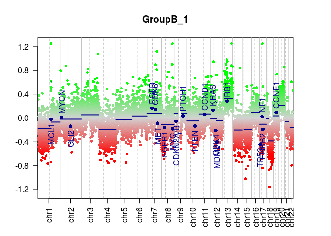
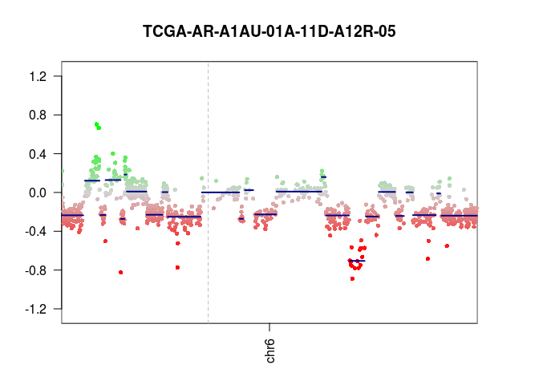

# Overview

*CopyNeutralIMA* provides reference samples for performing copy-number
variation (CNV) analysis using Illumina Infinium 450k or EPIC DNA
methylation arrays. There is a number of R/Bioconductor packages that do
genomic copy number profiling, including
[*conumee*](http://bioconductor.org/packages/release/bioc/html/conumee.html)
(Hovestadt and Zapatka, [n.d.](#ref-conumee)),
[*ChAMP*](http://bioconductor.org/packages/release/bioc/html/ChAMP.html)
(Tian et al. [2017](#ref-champ)) or *CopyNumber450k*, now deprecated. In
order to extract information about the copy number alterations, a set of
copy neutral samples is required as a reference. The package
*CopyNumber450kData*, usually used to provide the reference, is no
longer available. Additionally, there has never been an effort to
provide reference samples for the EPIC arrays. To fill this gap of
lacking reference samples, we here introduce the *CopyNeutralIMA*
package.

# Description

In this package we provide a set of 51 IlluminaHumanMethylation450k and
13 IlluminaHumanMethylationEPIC samples. The provided samples consist of
material from healthy individuals with nominally no copy number
aberrations. Users of *conumee* or other copy number profiling packages
may use this data package as reference genomes.

# Data

We selected the data from different studies accessible in the [Gene
Expression Omnibus (GEO)](https://www.ncbi.nlm.nih.gov/geo/). In
particular, for 450k arrays samples from
[GSE49618](https://www.ncbi.nlm.nih.gov/geo/query/acc.cgi?acc=GSE49618)
(Ley et al. [2013](#ref-GSE49618)),
[GSE61441](https://www.ncbi.nlm.nih.gov/geo/query/acc.cgi?acc=GSE61441)
(Wei et al. [2015](#ref-GSE61441)) and
[GSE106089](https://www.ncbi.nlm.nih.gov/geo/query/acc.cgi?acc=GSE106089)
(Tomlinson et al. [2017](#ref-GSE106089)) were chosen. For EPIC arrays,
normal or control samples from series
[GSE86831](https://www.ncbi.nlm.nih.gov/geo/query/acc.cgi?acc=GSE86831)/[GSE86833](https://www.ncbi.nlm.nih.gov/geo/query/acc.cgi?acc=GSE86833)
(Pidsley et al. [2016](#ref-GSE86831)),
[GSE98990](https://www.ncbi.nlm.nih.gov/geo/query/acc.cgi?acc=GSE98990)
(Zhou, Laird, and Shen [2017](#ref-GSE98990)) and
[GSE100825](https://www.ncbi.nlm.nih.gov/geo/query/acc.cgi?acc=GSE100825)
(Guastafierro et al. [2017](#ref-GSE100825)) were chosen.

# Example with *conumee*

First, we load the data we want to analyse and rename it. We will use
the examples provided by the
[*minfiData*](https://bioconductor.org/packages/release/data/experiment/html/minfiData.html)
(Daniel, Aryee, and Timp [2018](#ref-minfiData)) package and will follow
the steps described in the vignette of *conumee*.

``` r
library(minfi)
library(conumee)
library(minfiData)

data(RGsetEx)
sampleNames(RGsetEx) <- pData(RGsetEx)$Sample_Name
cancer <- pData(RGsetEx)$status == 'cancer'
RGsetEx <- RGsetEx[,cancer]
RGsetEx
#> class: RGChannelSet 
#> dim: 622399 3 
#> metadata(0):
#> assays(2): Green Red
#> rownames(622399): 10600313 10600322 ... 74810490 74810492
#> rowData names(0):
#> colnames(3): GroupB_3 GroupB_1 GroupB_2
#> colData names(13): Sample_Name Sample_Well ... Basename filenames
#> Annotation
#>   array: IlluminaHumanMethylation450k
#>   annotation: ilmn12.hg19
```

After loading the data we normalize it:

``` r
MsetEx <- preprocessIllumina(RGsetEx)
MsetEx
#> class: MethylSet 
#> dim: 485512 3 
#> metadata(0):
#> assays(2): Meth Unmeth
#> rownames(485512): cg00050873 cg00212031 ... ch.22.47579720R
#>   ch.22.48274842R
#> rowData names(0):
#> colnames(3): GroupB_3 GroupB_1 GroupB_2
#> colData names(13): Sample_Name Sample_Well ... Basename filenames
#> Annotation
#>   array: IlluminaHumanMethylation450k
#>   annotation: ilmn12.hg19
#> Preprocessing
#>   Method: Illumina, bg.correct = TRUE, normalize = controls, reference = 1
#>   minfi version: 1.27.5
#>   Manifest version: 0.4.0
```

Now we load our control samples, from the same array type as our test
samples and normalize them:

``` r
library(CopyNeutralIMA)
ima <- annotation(MsetEx)[['array']]
RGsetCtrl <- getCopyNeutralRGSet(ima)
# preprocess as with the sample data
MsetCtrl <- preprocessIllumina(RGsetCtrl)
MsetCtrl
#> class: MethylSet 
#> dim: 485512 51 
#> metadata(0):
#> assays(2): Meth Unmeth
#> rownames(485512): cg00050873 cg00212031 ... ch.22.47579720R
#>   ch.22.48274842R
#> rowData names(0):
#> colnames(51): GSM1185582 GSM1185583 ... GSM2829413 GSM2829418
#> colData names(7): ID gsm ... source_name_ch1 characteristics_ch1
#> Annotation
#>   array: IlluminaHumanMethylation450k
#>   annotation: ilmn12.hg19
#> Preprocessing
#>   Method: Illumina, bg.correct = TRUE, normalize = controls, reference = 1
#>   minfi version: 1.27.5
#>   Manifest version: 0.4.0
```

Finally we can run the conumee analysis following the author’s
indications:

``` r
# use the information provided by conumee to create annotation files or define
# them according to the package instructions
data(exclude_regions)
data(detail_regions)
anno <- CNV.create_anno(array_type = "450k", exclude_regions = exclude_regions, detail_regions = detail_regions)
#> using genome annotations from UCSC
#> getting 450k annotations
#>  - 470870 probes used
#> importing regions to exclude from analysis
#> importing regions for detailed analysis
#> creating bins
#>  - 53891 bins created
#> merging bins
#>  - 15820 bins remaining

# load in the data from the reference and samples to be analyzed
control.data <- CNV.load(MsetCtrl)
ex.data <- CNV.load(MsetEx)

cnv <- CNV.fit(ex.data["GroupB_1"], control.data, anno)
cnv <- CNV.bin(cnv)
cnv <- CNV.detail(cnv)
cnv <- CNV.segment(cnv)
cnv
#> CNV analysis object
#>    created   : Thu Aug  2 22:26:23 2018
#>   @name      : GroupB_1
#>   @anno      : 22 chromosomes, 470870 probes, 15820 bins
#>   @fit       : available (noise: 2.32)
#>   @bin       : available (shift: 0.005)
#>   @detail    : available (20 regions)
#>   @seg       : available (29 segments)

CNV.genomeplot(cnv)
```

<!-- -->

``` r
CNV.genomeplot(cnv, chr = 'chr18')
```

<!-- -->

``` r

head(CNV.write(cnv, what = 'segments'))
#>         ID chrom loc.start   loc.end num.mark     bstat          pval
#> 1 GroupB_1  chr1    635684 148927230      931 21.475711  1.422312e-99
#> 2 GroupB_1  chr1 149077230 149379823        5 26.044755 7.787661e-147
#> 3 GroupB_1  chr1 149579823 249195311      657        NA            NA
#> 4 GroupB_1 chr10    105000 135462374      840        NA            NA
#> 5 GroupB_1 chr11    130000 134873258      914        NA            NA
#> 6 GroupB_1 chr12    172870  65175000      413  8.802509  1.958883e-16
#>   seg.mean seg.median
#> 1   -0.194     -0.180
#> 2    3.058      0.621
#> 3   -0.077     -0.070
#> 4   -0.054     -0.050
#> 5    0.081      0.068
#> 6   -0.006     -0.015
head(CNV.write(cnv, what='probes'))
#>   Chromosome Start   End    Feature GroupB_1
#> 1       chr1 15864 15865 cg13869341   -0.064
#> 2       chr1 18826 18827 cg14008030   -0.321
#> 3       chr1 29406 29407 cg12045430    0.109
#> 4       chr1 29424 29425 cg20826792   -0.264
#> 5       chr1 29434 29435 cg00381604   -0.069
#> 6       chr1 68848 68849 cg20253340   -0.360
```

# Session info

    #> R version 3.5.0 (2018-04-23)
    #> Platform: x86_64-pc-linux-gnu (64-bit)
    #> Running under: openSUSE 13.1 (Bottle) (x86_64)
    #> 
    #> Matrix products: default
    #> BLAS: /usr/lib64/blas/libblas.so.3.4.2
    #> LAPACK: /usr/lib64/lapack/liblapack.so.3.4.2
    #> 
    #> locale:
    #>  [1] LC_CTYPE=en_US.UTF-8       LC_NUMERIC=C              
    #>  [3] LC_TIME=en_US.UTF-8        LC_COLLATE=en_US.UTF-8    
    #>  [5] LC_MONETARY=en_US.UTF-8    LC_MESSAGES=en_US.UTF-8   
    #>  [7] LC_PAPER=en_US.UTF-8       LC_NAME=C                 
    #>  [9] LC_ADDRESS=C               LC_TELEPHONE=C            
    #> [11] LC_MEASUREMENT=en_US.UTF-8 LC_IDENTIFICATION=C       
    #> 
    #> attached base packages:
    #> [1] stats4    parallel  stats     graphics  grDevices utils     datasets 
    #> [8] methods   base     
    #> 
    #> other attached packages:
    #>  [1] CopyNeutralIMA_0.99.9                              
    #>  [2] minfiData_0.27.0                                   
    #>  [3] conumee_1.15.0                                     
    #>  [4] IlluminaHumanMethylationEPICmanifest_0.3.0         
    #>  [5] IlluminaHumanMethylationEPICanno.ilm10b2.hg19_0.6.0
    #>  [6] IlluminaHumanMethylation450kmanifest_0.4.0         
    #>  [7] IlluminaHumanMethylation450kanno.ilmn12.hg19_0.6.0 
    #>  [8] minfi_1.27.5                                       
    #>  [9] bumphunter_1.23.0                                  
    #> [10] locfit_1.5-9.1                                     
    #> [11] iterators_1.0.10                                   
    #> [12] foreach_1.4.4                                      
    #> [13] Biostrings_2.49.0                                  
    #> [14] XVector_0.21.3                                     
    #> [15] SummarizedExperiment_1.11.6                        
    #> [16] DelayedArray_0.7.22                                
    #> [17] BiocParallel_1.15.8                                
    #> [18] matrixStats_0.54.0                                 
    #> [19] Biobase_2.41.2                                     
    #> [20] GenomicRanges_1.33.7                               
    #> [21] GenomeInfoDb_1.17.1                                
    #> [22] IRanges_2.15.16                                    
    #> [23] S4Vectors_0.19.19                                  
    #> [24] BiocGenerics_0.27.1                                
    #> 
    #> loaded via a namespace (and not attached):
    #>   [1] siggenes_1.55.0               mclust_5.4.1                 
    #>   [3] rprojroot_1.3-2               DNAcopy_1.55.0               
    #>   [5] base64_2.0                    bit64_0.9-7                  
    #>   [7] interactiveDisplayBase_1.19.0 AnnotationDbi_1.43.1         
    #>   [9] xml2_1.2.0                    codetools_0.2-15             
    #>  [11] splines_3.5.0                 knitr_1.20                   
    #>  [13] Rsamtools_1.33.3              annotate_1.59.1              
    #>  [15] shiny_1.1.0                   HDF5Array_1.9.5              
    #>  [17] BiocManager_1.30.1            readr_1.1.1                  
    #>  [19] compiler_3.5.0                httr_1.3.1                   
    #>  [21] backports_1.1.2               assertthat_0.2.0             
    #>  [23] Matrix_1.2-14                 limma_3.37.3                 
    #>  [25] later_0.7.3                   htmltools_0.3.6              
    #>  [27] prettyunits_1.0.2             tools_3.5.0                  
    #>  [29] bindrcpp_0.2.2                glue_1.3.0                   
    #>  [31] GenomeInfoDbData_1.1.0        dplyr_0.7.6                  
    #>  [33] doRNG_1.7.1                   Rcpp_0.12.18                 
    #>  [35] multtest_2.37.0               preprocessCore_1.43.0        
    #>  [37] nlme_3.1-137                  ExperimentHub_1.7.2          
    #>  [39] rtracklayer_1.41.3            DelayedMatrixStats_1.3.4     
    #>  [41] gbRd_0.4-11                   stringr_1.3.1                
    #>  [43] mime_0.5                      rngtools_1.3.1               
    #>  [45] XML_3.98-1.12                 beanplot_1.2                 
    #>  [47] AnnotationHub_2.13.1          zlibbioc_1.27.0              
    #>  [49] MASS_7.3-50                   BiocInstaller_1.31.1         
    #>  [51] promises_1.0.1                hms_0.4.2                    
    #>  [53] rhdf5_2.25.4                  GEOquery_2.49.0              
    #>  [55] RColorBrewer_1.1-2            curl_3.2                     
    #>  [57] yaml_2.1.19                   memoise_1.1.0                
    #>  [59] pkgmaker_0.27                 biomaRt_2.37.3               
    #>  [61] reshape_0.8.7                 stringi_1.2.4                
    #>  [63] RSQLite_2.1.1                 genefilter_1.63.0            
    #>  [65] GenomicFeatures_1.33.0        bibtex_0.4.2                 
    #>  [67] Rdpack_0.8-0                  rlang_0.2.1                  
    #>  [69] pkgconfig_2.0.1               bitops_1.0-6                 
    #>  [71] nor1mix_1.2-3                 evaluate_0.11                
    #>  [73] lattice_0.20-35               purrr_0.2.5                  
    #>  [75] Rhdf5lib_1.3.1                bindr_0.1.1                  
    #>  [77] GenomicAlignments_1.17.3      bit_1.1-12                   
    #>  [79] tidyselect_0.2.4              plyr_1.8.4                   
    #>  [81] magrittr_1.5                  R6_2.2.2                     
    #>  [83] DBI_1.0.0                     pillar_1.3.0                 
    #>  [85] withr_2.1.2                   survival_2.42-3              
    #>  [87] RCurl_1.95-4.11               tibble_1.4.2                 
    #>  [89] crayon_1.3.4                  rmarkdown_1.10               
    #>  [91] progress_1.2.0                grid_3.5.0                   
    #>  [93] data.table_1.11.4             blob_1.1.1                   
    #>  [95] digest_0.6.15                 xtable_1.8-2                 
    #>  [97] tidyr_0.8.1                   httpuv_1.4.5                 
    #>  [99] illuminaio_0.23.2             openssl_1.0.1                
    #> [101] registry_0.5                  quadprog_1.5-5

# References

<div id="refs" class="references">

<div id="ref-minfi">

Aryee, MJ, AE Jaffe, H Corrada-Bravo, C Ladd-Acosta, AP Feinberg, KD
Hansen, and RA Irizarry. 2014. “Minfi: A flexible and comprehensive
Bioconductor package for the analysis of Infinium DNA Methylation
microarrays.” *Bioinformatics* 30 (10): 1363–9.
<https://doi.org/10.1093/bioinformatics/btu049>.

</div>

<div id="ref-minfiData">

Daniel, K, M Aryee, and W Timp. 2018. *minfiData: Example data for the
Illumina Methylation 450k array*.

</div>

<div id="ref-GSE100825">

Guastafierro, T, MG Bacalini, A Marcoccia, D Gentilini, S Pisoni, AM Di
Blasio, A Corsi, et al. 2017. “Genome-wide DNA methylation analysis in
blood cells from patients with Werner syndrome.” *Clinical Epigenetics*
9: 92. <https://doi.org/10.1186/s13148-017-0389-4>.

</div>

<div id="ref-conumee">

Hovestadt, V, and M Zapatka. n.d. *conumee: Enhanced copy-number
variation analysis using Illumina DNA methylation arrays*. Division of
Molecular Genetics, German Cancer Research Center (DKFZ), Heidelberg,
Germany. <http://bioconductor.org/packages/conumee/>.

</div>

<div id="ref-GSE49618">

Ley, TJ, C Miller, L Ding, and The Cancer Genome Atlas Research Network.
2013. “Genomic and epigenomic landscapes of adult de novo acute myeloid
leukemia.” *The New England of Journal Medicine* 368 (22): 2059–74.
<https://doi.org/10.1056/NEJMoa1301689>.

</div>

<div id="ref-GSE86831">

Pidsley, R, E Zotenko, TJ Peters, MG Lawrence, GP Risbridger, P Molloy,
S Van Djik, B Muhlhausler, C Stirzaker, and SJ Clark. 2016. “Critical
evaluation of the Illumina MethylationEPIC BeadChip microarray for
whole-genome DNA methylation profiling.” *Genome Biology* 17 (1): 208.
<https://doi.org/10.1186/s13059-016-1066-1>.

</div>

<div id="ref-champ">

Tian, Y, TJ Morris, AP Webster, Z Yang, S Beck, A Feber, and AE
Teschendorff. 2017. “ChAMP: updated methylatioon analysis pipeline for
Illumina BeadChips.” *Bioinformatics* 33 (24): 3982–4.
<https://doi.org/10.1093/bioinformatics/btx513>.

</div>

<div id="ref-GSE106089">

Tomlinson, MS, PA Bommarito, EM Martin, L Smeester, RN Fichorova, AB
Onderdonk, KCK Kuban, TM O’Shea, and RC Fry. 2017. “Microorganisms in
the human placenta are associated with altered CpG methylation of immune
and inflammation-related genes.” *PLoS One* 12 (12): e0188664.
<https://doi.org/10.1371/journal.pone.0188664>.

</div>

<div id="ref-GSE61441">

Wei, JH, A Haddad, JH Luo, and others. 2015. “A CpG-methylation-based
assay to predict survival in clear cell renal cell carcinoma.” *Nature
Communications* 30 (6): 8699. <https://doi.org/10.1038/ncomms9699>.

</div>

<div id="ref-GSE98990">

Zhou, W, PW Laird, and H Shen. 2017. “Comprehensive characterization,
annotation and innovative use of Infinium DNA methylation BeadChip
probes.” *Nucleic Acids Research* 45 (4): e22.
<https://doi.org/10.1093/nar/gkw967>.

</div>

</div>
